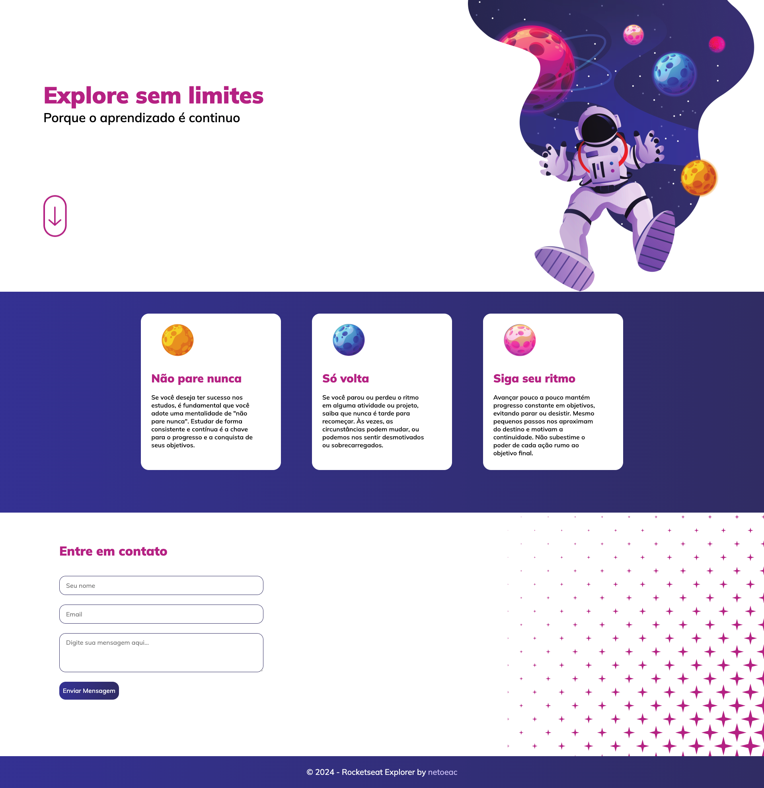

<h1 align="center"> Landing Page - Explore 🧑‍🚀</h1>

 

## 💻 About this project

This project was provided by Rocketseat course that the goal is build a landing page using the mobile-first.

Demo link: https://lpexplore.netlify.app/

## 🔖 Layout

You can view the project's layout from [this link](https://www.figma.com/file/OL7TU5WT5vUM6ImuWjNNdN/Explore-sem-limites-Copy?fuid=1175785572584714384). To access is neccessary to have an account on [Figma](https://figma.com).

## ⚡️ Techs

This project was developed using this following techs:

- HTML & CSS
- Git & Github
- Figma

  

This project was developed following the instructions from Rocketseat  :rocket: [Rocketseat community on Discord](https://discord.gg/rocketseat)
